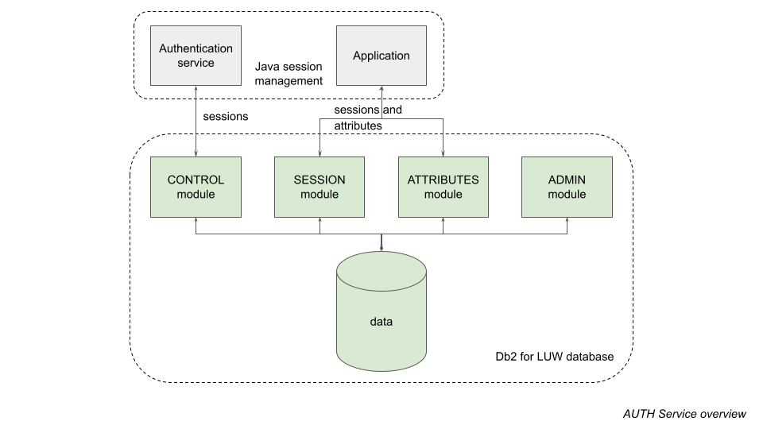

# _About the AUTH Service_

# Synopsis
The AUTH Service is an off-the-peg JDBC session and attribute store, enabling sessions and session attributes to be persisted and retrieved efficiently, with a Db2 for LUW database as the persistent store. The design supports high workload environments and 24x7 availability.

## See also
See https://easydataservices.github.io/db2-auth/java/javadoc/index.html for Javadoc.

# Design features
The author has seen JDBC session management implementations that proved problematic in the real world. The AUTH Service includes several features to avoid potential pitfalls:

* Availability: The service is designed for 24x7 operation.
* Atomicity: Session attributes can be saved and retrieved in a single operation. This ensures consistency between related attributes when persisted.
* Locking: The service is coded to avoid deadlocks and to minimise lock contention (generally to avoid lock waits completely); also to ensure that rare unavoidable lock waits are momentary.
* Housekeeping: The service is designed for full housekeeping without affecting availability.
* LOB performance: The service uses table partitioning to minimise likelihood and severity of contention for buddy space during concurrent LOB updates.
* Lazy loading: JDBC methods support change detection and lazy loading of only changed attributes from the database. Although use of this feature is optional, it reduces load on the network and database if your attributes are large.

# Interface
The design is implemented with database modules, each covering a specific functional area:
* CONTROL: Routines for adding, updating and removing sessions.
* SESSION: Routines for retrieving sessions.
* ATTRIBUTES: Routines for persisting and retrieving session attributes.
* ADMIN: Routines for housekeeping.

A corresponding Java DAO class is provided for the first 3 modules listed above.

# Project status
In final testing before a first formal release.

# Further documentation

| Document | Primary audience | Description |
| -------- | ---------------- | ----------- |
| [INSTALL](docs/INSTALL.md) | all | Installation instructions |
| [DESIGN_SESSIONS](docs/DESIGN_SESSIONS.md) | developers | Session management design notes |
| [DESIGN_ATTRIBUTES](docs/DESIGN_ATTRIBUTES.md) | developers | Session attribute management design notes |
| [ADMIN](docs/ADMIN.md) | all | Administration |
| [ERROR_CODES](docs/ERROR_CODES.md) | all | AUTH Service user-defined SQLSTATE error codes |
